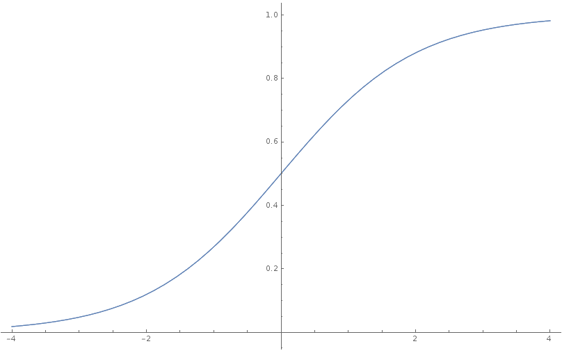
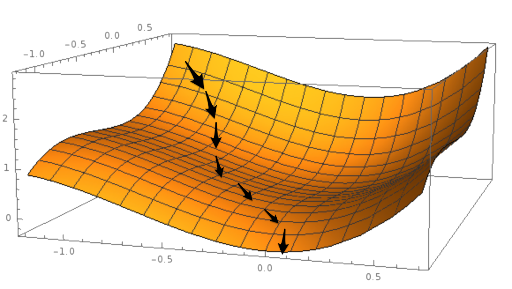
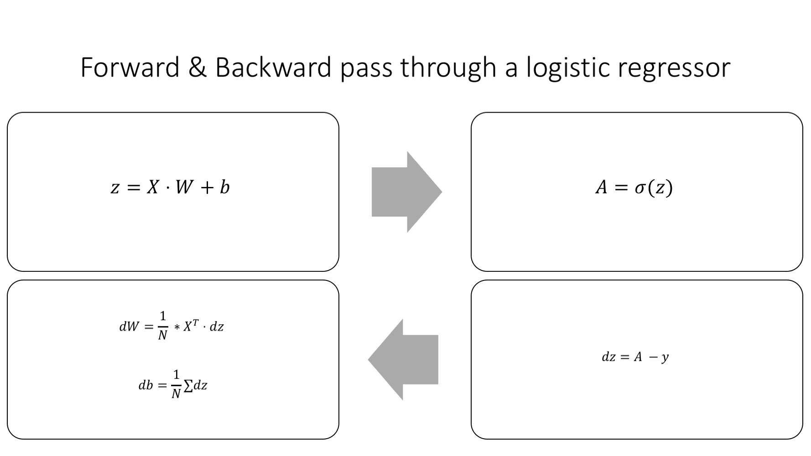
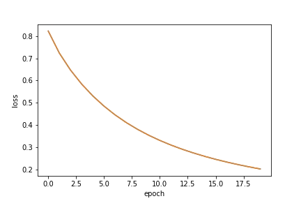
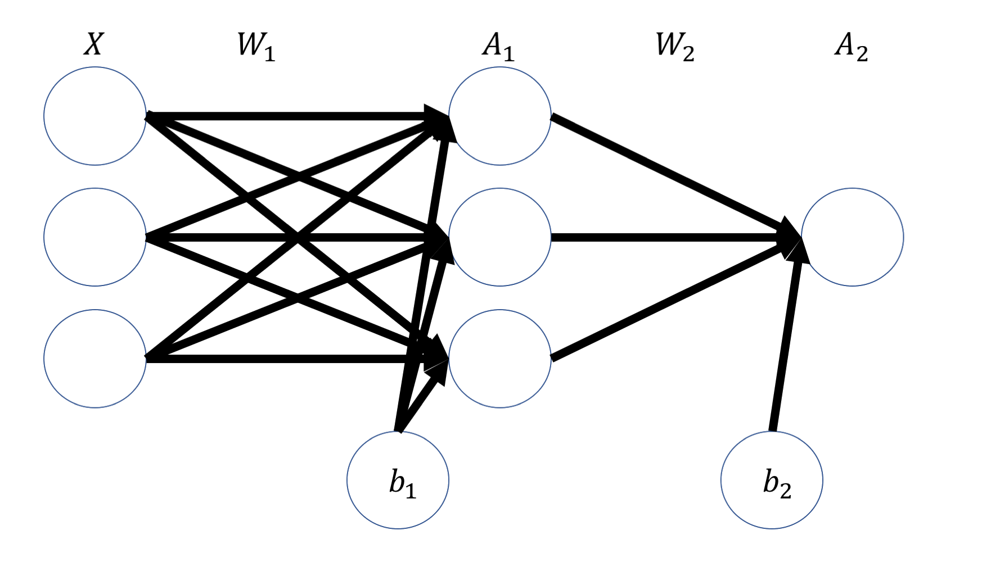
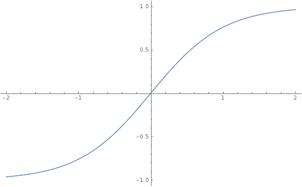

# Chapter 1 - A Neural Network From Scratch

# Introduction
I recent years, machine learning has made great strides. Within a few years, researchers mastered tasks that where previously seen as unsolvable. From identifying objects in images, to transcribing voice, to playing complex board games, modern machine learning has matched or beaten human performance at a dazzling range of tasks. Interestingly, a single technique called 'deep learning' is behind all these advances. In fact, the bulk of of advances come from a subfield of deep learning called 'deep neural networks'. In this chapter, we will explore, how and why neural networks work.

# Approximating functions

There are many views on how to best think about neural networks (NNs), but perhaps the most useful is to see them as **function approximators**. Functions in math relate some input $x$ to some output $y$. We can write it as:

$$y = f(x)$$

A simple function could be:

$$f(x) = 4 * x$$

In this case, we can give the function an input $x$ and it would quadruple it:

$$y = f(2) = 8$$

You might have seen functions like this in school. But functions can do more. They can map any element from a set (speak: the collection of values the function accepts) to another element of a set. These sets can be something other than simple numbers. A function could for example also map an image to an identification of what is in the image: 

$$imageContent = f(image)$$

This function would map an image of a cat to the label 'cat'.

Note that for a computer, images are matrices full of numbers and that any description of an image content would also be stored as a matrix of numbers. 

A neural network, if it is big enough, can approximate any function. This means, that a neural network, if big enough, could also approximate our function $f$ for mapping images to their content. The condition that the neural network has to be 'big enough' explains why 'deep' (speak: big) neural networks have taken off. 

The fact that 'big enough' neural networks can approximate any function means that they are useful for a large number of tasks.

# A forward pass

For the rest of the chapter we will be working with a simple problem: Given an input vector $X$ we want to output the first element of the vector. We already know we need data to train a neural network so this will be our dataset for the exercise:

|$X_1$|$X_2$|$X_3$|$y$|
|-|-|-|---|
|0|1|0|0|
|1|0|0|1|
|1|1|1|1|
|0|1|1|0|

In this dataset, each row contains an input vector $X$ and an output $y$.

The data follows the formula: 
$$ y = X_1$$
So the function we want to approximate is:
$$ f(X) = X_1$$

In this case, writing down the function is relatively straightforward but keep in mind that in most cases it is not possible to write down the function, as functions expressed by deep neural nets can get very complex.

For this simple function, a shallow neural network with only one layer is enough. Such shallow networks are also called logistic regressors.
## A logistic regressor 
The graphic below shows a logistic regressor. $X$ is our input vector, here shown as it's three components, $X_1$, $X_2$, $X_3$. $W$ is a vector of three weights. You can imagine it as the thickness of each of the three lines. $W$ determines how much each of the values of $X$ goes into the the next layer. $b$ is the bias. It can move the output of the layer up or down.


To compute the output of the regressor, we first do a **linear step**. We compute the dot product of the input $X$ and the weights $W$. This is the same as multiplying each value of $X$ with it's weight and then taking the sum. To this number, we add the bias $b$. Afterwards, we do a **non linear step**. In the non linear step, we run the linear intermediate product $z$ through an **activation function**, in this case, the sigmoid function. The sigmoid function squishes input values to outputs between zero and one.



## Python version of our logistic regressor

If all the math above was a bit too theoretical for you, rejoice! We will now implement the same in Python.

We will use a library called numpy which enables easy and fast matrix operations in Python. To ensure we get the same result in all of our experiments, we have to set a random seed.

```python
import numpy as np
np.random.seed(1)
```

Since our dataset is quite small, we define it manually as numpy matrices.

```Python
X = np.array([[0,1,0],
              [1,0,0],
              [1,1,1],
              [0,1,1]])

y = np.array([[0,1,1,0]]).T
```

We can define the sigmoid activation function as a Python function.

```python
def sigmoid(x):
    return 1/(1+np.exp(-x))    
```

So far, so good. Now we need to initialize $W$. In this case, we actually know already which values $W$ should have. But we can not know for other problems where we do not know the function yet. So we have to assign weights randomly. The weights are usually assigned randomly with a mean of zero. The bias is usually set to zero by default
```python 
W = 2*np.random.random((3,1)) - 1
b = 0
```

Now that all variables are set, we can do the linear step:

```python
z = X.dot(W) + b
```
And the non linear step.
```python 
A = sigmoid(z)
```

If we print out $A$ now, we get the following output:
```Python
print(A)
```
```
out:
[[ 0.60841366]
 [ 0.45860596]
 [ 0.3262757 ]
 [ 0.36375058]]
```
This looks nothing like our desired output $y$ at all! Clearly, our regressor is representing _some_ function, but it is quite far away from the function we want. To better approximate our desired function, we have to tweak the weights $W$ and the bias $b$ to get better results.

# Optimizing model parameters

We already saw that we need to tweak the weights and biases, collectively called parameters, of our model to arrive at a closer approximation of our desired function. In other words, we need to look through the space of possible functions that can be represented by our model to find a function $\hat f$ that matches our desired function $f$ as close as possible. But how would we know how close we are? In fact, since we do not know $f$, we can not directly know how close our hypothesis $\hat f$ is to $f$. But we can measure how well $\hat f$'s outputs match the output of $f$. The expected outputs of $f$ given $X$ are the labels $y$. So we can try to approximate $f$ by finding a function $\hat f$ whose outputs are also $y$ given $X$.

We know that:
$$f(X) = y$$
And:
$$\hat f(X) = \hat y$$
So we can try to find $f$ by optimizing:

$$\underset{\hat f \in \mathcal{H}}{\text{minimize }} D(y,\hat y)$$


Where $\mathcal{H}$ is the space of functions that can be represented by our model, also called hypothesis space, and D is the distance function which we use to evaluate how close $\hat y$ and $y$ are. 

Note that this approach makes a crucial assumption: That our data $X$ and labels $y$ represent our desired function $f$. This is not always the case. When our data contains systematic biases, we might gain a function that fits our data well, but that is different from the one we wanted. An example comes from human resource management: Imagine you are trying to build a model that predicts whether an employee should be promoted. As training data you use promotion decisions made by human HRM managers. As these managers might be biased, women still are still a minority in boardrooms, your function would also be biased. You'd end up with a function mirroring or even amplifying human biases rather than a function predicting who should be promoted. It is a commonly made mistake to believe that a neural network will find the intuitive function we are looking for. **A neural network will find the function that best fits the data with no regard to whether that is the desired function.**

# Measuring model loss
We already saw that we optimize parameters by minimizing some distance function $D$. This distance function, also called loss function, is the performance measure under which we evaluate possible functions. In this case, our problem is a binary classification problem, so we will use the binary cross entropy loss:
$$D_{BCE}(y,\hat y) = -\frac{1}{N} \sum_{i = i}^N[y_i  log(\hat y_i) + (1-y_i)log(1-\hat y_i)]$$

Let's go through this step by step.
 
 1. $D_{BCE}(y,\hat y)$ is the distance function for binary cross entropy loss.
 
 
 2. $-\frac{1}{N} \sum_{i=1}^N$ The loss over a batch of N examples is the average loss of all examples. 
 
 
 3. $y_i * \log \hat y_i$ This part of the loss only comes into play if the true value, $y_i$ is 1. If $y_i$ is 1, we want $\hat y_i$ to be as close to 1 as possible, to achieve a low loss.
 
 
 4. $(1-y_i)\log(1-\hat y_i)$ This part of the loss comes into play if $y_i$ is 0. If so, we want $\hat y_i$ to be close to 0 as well.

In Python this loss function is implemented as follows:
```python
def bce_loss(y,y_hat):
  N = y.shape[0]
  loss = -1/N * (y*np.log(y_hat) + (1 - y)*np.log(1-y_hat))
  return loss 
```
The output `A` of our logistic regressor is equal $\hat y$ so we can calculate the binary cross entropy loss as follows:
```python
loss = bce_loss(y,A)
print(loss)
```
```
out: 
0.82232258208779863
```
This is quite a high loss, so we should now see how we can improve our model.

## Gradient descent
Now that we know what we judge our candidate models $\hat f$ by, how do we tweak the parameters to obtain better models. The most popular optimization algorithm for neural networks is called gradient descent. 

Imagine you are on a mountain forrest on a hike. You have lost the track and are now in the woods trying to find home to the valley. Since there are so many trees, you can not see the valley, you can only see the ground under you. How would you find your way down? One sensible approach would be to follow the slope of the mountain. Where the slope goes downwards, you go. This is the same as a gradient descent algorithm does. The loss function is the mountain and to get to a low loss, the algorithm follows the slope, that is the derivative, of the loss function. When we walk down the mountain, we are updating our location coordinates. The algorithm updates the parameters of the neural network.

 

Gradient descent requires that the loss function has a derivative with respect to the parameters that we want to optimize. This works fine for most supervised learning problems but things become more difficult when we want to tackle problems for which there is no obvious derivative. Gradient descent can also only optimize the parameters, weights and biases of our model. It can not optimize how many layers our model has or which activation functions it should use since there is no way to compute the gradient with respect to model topology. These settings which can not be optimized by gradient descent are called **hyper-parameters** and are usually set by humans.

## Backpropagation 

To update the parameters, we need to calculate the derivative of the loss function with respect to the weights and biases. If you imagine the parameters of our models like the geo coordinates in our mountain analogy, calculating the loss derivative with respect to a parameter is like checking the mountain slope in the direction north to see whether you should go north or south.


Note: to keep things simple, we refer to the derivative of the loss function to any variable as $d$variable. For example we write the derivative of the loss function with respect to the weights as $dW$.

To calculate the gradient with respect to different parameters of our model, we can make use of the chain rule. You might remember the chain rule as:

$$(f(g(x)))' = g(x)' * f'(g(x))$$

Sometimes also written as:
$$\frac{dy}{dx} = \frac{dy}{du} \frac{du}{dx}$$

What the chain rule basically says is that if you want to take the derivative through a number of nested functions you multiply the derivative of the inner function with the derivative of the outer function. This is useful since neural networks, and our logistic regressor, are nested functions. The input goes through the linear step, a function of input, weights and biases. The output of the linear step, $z$ goes through the activation function.

So when we compute the loss derivative with respect to weights and bias, we first compute the loss derivative with respect to the output of the linear step $z$, and use it to compute the $dW$. In code it looks like this:
```python
dz = (A - y)

dW = 1/N * np.dot(X.T,dz)

db = 1/N * np.sum(dz,axis=0,keepdims=True)     
```

## Parameter updates
Now we have the gradients, how do we improve our model? Or, to stay with our mountain analogy, now that we know that the mountain goes up in the North direction and up in the East direction, where do we go? To the South and to the West of course! Mathematically speaking, we go in the opposite direction than the gradient. If the gradient is positive with respect to a parameter, speak the slope is upward, we reduce the parameter. If it is negative, speak downward sloping, we increase it. When our slope is steeper, we move our gradient more.

The update rule for a parameter p then goes like:
$$p = p - \alpha * dp$$

Where $p$ is a model parameter (either a weight or a bias), $dp$ is the loss derivative with respect to $p$ and $\alpha$ is the **learning rate**. The learning rate is something like the gas pedal in a car. It sets how much we want to apply the gradient updates. It is one of those hyper parameters that we have to set manually. We will discuss it in the next chapter.

In code, our parameter updates look like this:
```python 
alpha = 1
W -= alpha * dW
b -= alpha * db
```

## Putting it all together
You have now seen all parts needed to train a neural network. We will train a 1 layer neural network, also called logistic regressor or logit model:

First we import numpy and define the data
```python 
import numpy as np
np.random.seed(1)

X = np.array([[0,1,0],
              [1,0,0],
              [1,1,1],
              [0,1,1]])

y = np.array([[0,1,1,0]]).T
```
Then we define the sigmoid activation function and loss function:
```python 
def sigmoid(x):
    return 1/(1+np.exp(-x))

def bce_loss(y,y_hat):
    N = y.shape[0]
    loss = -1/N * np.sum((y*np.log(y_hat) + (1 - y)*np.log(1-y_hat)))
    return loss 
```

We randomly initialize our model:

```python 
W = 2*np.random.random((3,1)) - 1
b = 0
```

We also need to set some hyper parameters. The first one is alpha which we will just set to 1 here. The second one is the number of times we want to run the training process, also called the number of epochs we want to run.
```python 
alpha = 1
epochs = 20
```
Since it is used in the training loop, it is useful to define the number of samples in our data. We also define an empty array to keep track of the models losses over time:
```python 
N = y.shape[0]
losses = []
```
Now we come to the main trainings loop:
```python
for i in range(epochs):
    # Forward pass
    z = X.dot(W) + b 
    A = sigmoid(z)
    
    # Calculate loss
    loss = bce_loss(y,A)
    print('Epoch:',i,'Loss:',loss)
    losses.append(loss)
    
    # Calculate derivatives
    dz = (A - y)
    dW = 1/N * np.dot(X.T,dz)
    db = 1/N * np.sum(dz,axis=0,keepdims=True)    
    
    # Parameter updates
    W -= alpha * dW
    b -= alpha * db
```
When we run this we get the following output: 
```
out: 
Epoch: 0 Loss: 0.822322582088
Epoch: 1 Loss: 0.722897448125
Epoch: 2 Loss: 0.646837651208
Epoch: 3 Loss: 0.584116122241
Epoch: 4 Loss: 0.530908161024
Epoch: 5 Loss: 0.48523717872
Epoch: 6 Loss: 0.445747750118
Epoch: 7 Loss: 0.411391164148
Epoch: 8 Loss: 0.381326093762
Epoch: 9 Loss: 0.354869998127
Epoch: 10 Loss: 0.331466036109
Epoch: 11 Loss: 0.310657702141
Epoch: 12 Loss: 0.292068863232
Epoch: 13 Loss: 0.275387990352
Epoch: 14 Loss: 0.260355695915
Epoch: 15 Loss: 0.246754868981
Epoch: 16 Loss: 0.234402844624
Epoch: 17 Loss: 0.22314516463
Epoch: 18 Loss: 0.21285058467
Epoch: 19 Loss: 0.203407060401
```
You can see that the loss steadily decreases. We can plot the loss to give it a closer look:
```python 
import matplotlib.pyplot as plt
plt.plot(losses)
plt.xlabel('epoch')
plt.ylabel('loss')
plt.show()
```


# A deeper network 
We established earlier that in order to approximate more complex functions, we need bigger, deeper networks. Creating a deeper networks works by stacking layers on top of each other.

In this section we will build a 2 layer neural network like this:


The input gets multiplied with the first set of weights $W_1$, producing an intermediate product $z_1$ and then run through an activation function to produce the first layers activations $A_1$. These activations then get multiplied with a second layer of weights $W_2$, producing an intermediate product $z_2$ which gets run through a second activation function which produces the output $A_2$ of our neural net.

```python 
z1 = X.dot(W1) + b1

a1 = np.tanh(z1)

z2 = a1.dot(W2) + b2

a2 = sigmoid(z2)
```
Note: The full code for this example can be found in the GitHub repository belonging to this book.

As you can see, the first activation function is not a sigmoid function but a tanh function. Tanh is a popular activation function for hidden layers and works a lot like sigmoid, except that it squishes values in the range between -1 and 1 rather than 0 and 1.



Backpropagation through our deeper network works by the chain rule, too. We go backwards through the network and multiply the derivatives.


```python 
# Calculate loss derivative with respect to output
dz2 = bce_derivative(y=y,y_hat=a2)

# Calculate loss derivative with respect to second layer weights
dW2 = (a1.T).dot(dz2)

# Calculate loss derivative with respect to second layer bias
db2 = np.sum(dz2, axis=0, keepdims=True)

# Calculate loss derivative with respect to first layer
dz1 = dz2.dot(W2.T) * tanh_derivative(a1)

# Calculate loss derivative with respect to first layer weights
dW1 = np.dot(X.T, dz1)

# Calculate loss derivative with respect to first layer bias
db1 = np.sum(dz1, axis=0)
```

Note that while the size of our input and outputs are determined by your problem, you can freely choose the size of your hidden layer. This is another hyper parameter you can tweak. We will look at the specifics of hidden layer sizes in chapter two.

# Exercises
In the code for this chapter you will find an implementation of a two layer neural network both in Python as well as in excel. Expand it to three layers.

# Summary
And that's it! This is how neural networks work. The rest of this book is about how to build more complex neural networks that can approximate more complex functions. As it turns out, there are a few tweaks to make to the basic structure that work well on specific tasks, such as image recognition. The basic ideas introduced in this chapter however stay the same.

- Neural networks are function approximators.
- We gauge how well our approximated function $\hat f$ performs through a loss function.
- Parameters of the model are optimized by updating them in the opposite direction of the derivative of the loss function with respect to the parameter.
- The derivatives are calculated backwards through the model using the chain rule in a process called backpropagation.

The key takeaway of this chapter is that while we are looking for a function $f$, we try to find it by optimizing a function to perform like $f$ on a dataset. A subtle but important distinction. We do not know if $\hat f$ works like $f$ at all. An often cited example is a military project that tried to use deep learning to spot tanks images. The model trained well on the dataset but once the pentagon wanted to try out their new tank spotting device, it failed miserably. It took a while to figure out that in the dataset used to develop the model, all pictures of tanks where taken on a cloudy day and pictures without a tank where taken on a sunny day. The model had learned to spot grey skies, not tanks. This is just one example of how your model might work very different than you think it does. And flawed data might seriously throw your model off track, sometimes without you noticing. However, for every failure, there are plenty of success stories in deep learning. It is one of the high impact technologies that will reshape the face of finance. 

