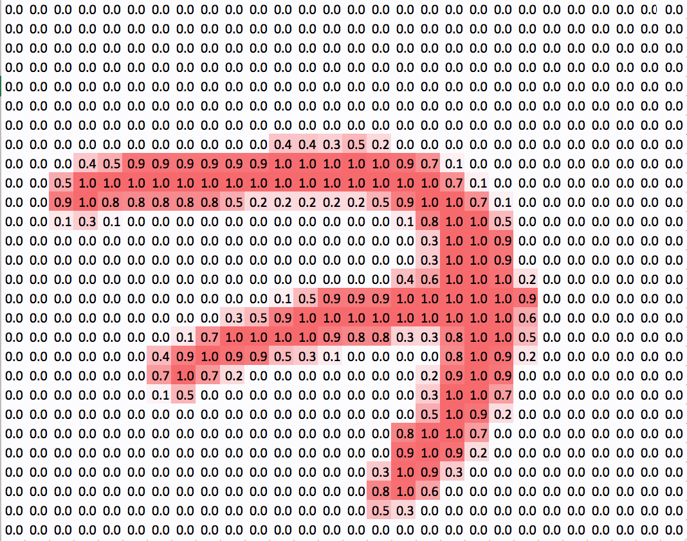
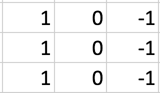
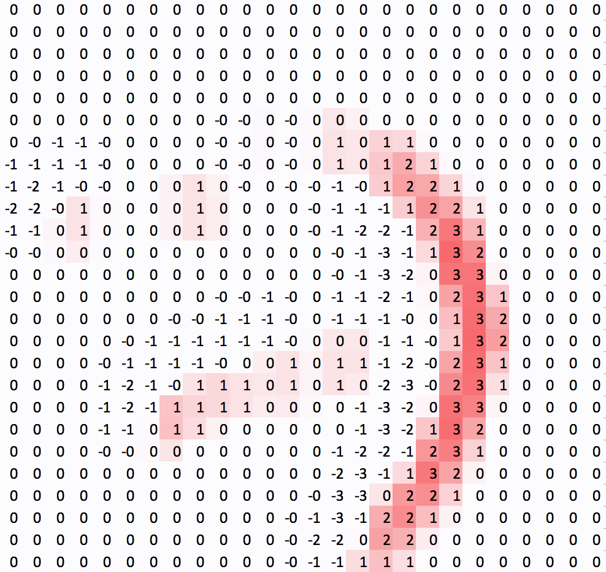
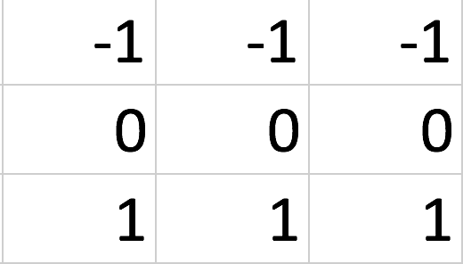
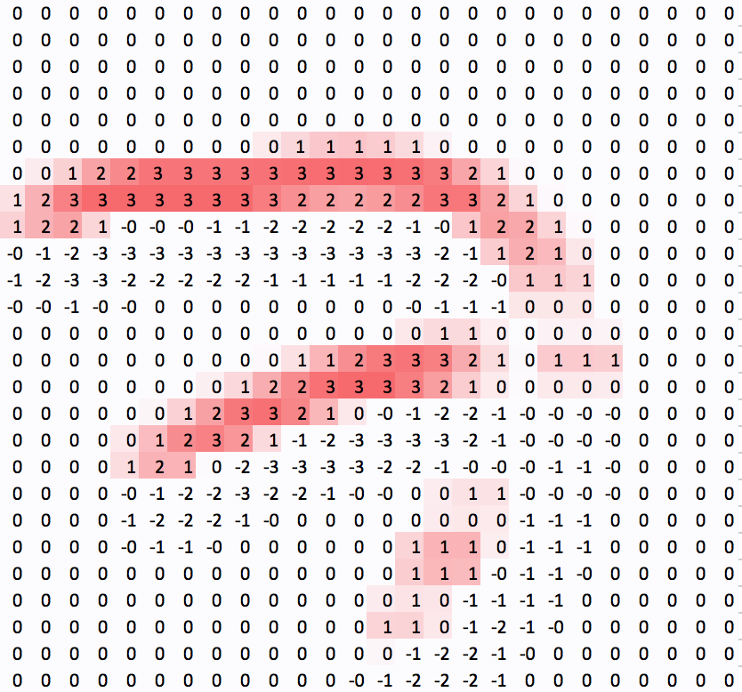
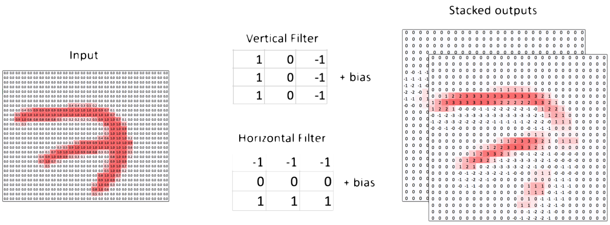

# Chapter 3 - Computer Vision
When Snapchat introduced a filter featuring a breakdancing hotdog, its stock price surged. But investors where less interested in the hotdogs handstand. What fascinated them was that Snap had built powerful computer vision technology. It's app could not only take pictures, it could find the surfaces in the pictures that a hotdog could breakdance on and then stick the hotdog there. Even when the user moved the phone, the hotdog kept dancing in the same spot.

The dancing hotdog might be one of the more silly applications of computer vision, but it shows the potential of the technology. In a world full of cameras, from the billions of smartphones to security cameras to satellites to IOT devices being able to interpret the images yields great benefit. 

Computer vision allows us to perceive and interpret the real world at scale. No analyst could ever look at millions of satellite images to mark mining sites and track their activity over time. But computers can. Another example of the same technology would be to count cars in the parking lots of retailers to estimate how well sales go. This kind is done by several firms and will probably find more usage in the future.

A slightly less fancy but never the less important application of computer vision in finance is insurance. Insurers might use drones to fly over roofs to spot issues before they become an expensive problem. Or they might inspect factories and equipment they insured. The applications are near endless.

# ConvNets
Convolutional Neural Networks, ConvNets for short, are the driving engine behind computer vision. ConvNets allow us to work with larger images while keeping the size of the network reasonable. The name Convolutional Neural Net comes from the mathematical operation that differentiates them from regular neural nets. Convolution is the mathematical correct term for sliding one matrix over another matrix. You will see in a minute why this is important for ConvNets but also why this is not the best name in the world. Actually, ConvNets should be called Filter Nets. Because what makes them work is the fact that they use filters. In this section, we will work with the MNIST dataset. The MNIST dataset is a collection of handwritten digits that has become a standard 'hallo world' application for computer vision.

## Filters on MNIST
What does a computer actually see when it sees an image? The value of the pixels are stored as numbers in the computer. So when the computer 'sees' a black and white image of a seven, what it actually sees is something like this:

The larger numbers in the image have been highlighted to make the seven visible for humans, but for the computer an image is really just numbers. This means, we can perform all kinds of mathematical operations on the image.

When detecting numbers, there are a few lower level features that make a number. A seven for example is a combination of one vertical straight line, one straight line on the top and one straight line through the middle. A nine for contrast is made up of four rounded lines that form a circle at the top and a straight, vertical line. When detecting numbers, there are a few lower level features that make a number. A seven for example is a combination of one vertical straight line, one straight horizontal line on the top and one straight horizontal line through the middle. A nine for contrast is made up of four rounded lines that form a circle at the top and a straight, vertical line.

And now comes the central idea behind ConvNets (or Filter Nets): We can use small filters that detect a certain kind of low level feature like a vertical line and then slide it over the entire image to detect all the vertical lines in there. This is how a vertical line filter would look like:

It is a 3 by 3 matrix. To detect vertical lines in our image, we slide this filter over the image. We start in the top left corner and slice out the most top left 3 by 3 grid of pixels (all zeros in this case). We then perform an element wise multiplication of all elements in the filter with all elements in the slice of the image. The nine products get then summed up and a bias is added. This value then forms the output of the filter and gets passed on as a new pixel to the next layer.

$$Z_1 = \sum{A_0 * F_1} + b_1$$

The output of our vertical line filter looks like this:

Notice that the vertical lines are visible while the horizontal lines are gone. Only a few artifacts remain. Also notice how the filter captures the vertical line from one side. Since it responds to high pixel values on the left, and low pixel values on the right, only the right side of the output shows strong positive values while the left side of the line actually shows negative values. This is not a big problem in practice as there are usually different filters for different kinds of lines and directions.

## Adding a second filter
Our vertical filter is cool, but we already noticed that we also need to filter our image for horizontal lines to detect a seven. Our vertical filter might look like this:

We can now slide this filter over our image the exact same way we did with the vertical filter. 

See how this filter removes the vertical lines and pretty much only leaves the horizontal lines?

But what do we now pass on to the next layer? We stack the outputs of both filters on top of each other, creating a 3 dimensional cube.

By adding multiple convolutional layers, our CNN can extract ever more complex and semantic features. 

# The building blocks of ConvNets in Keras
