# Chapter 4 - Time Series
Time series are the most iconic form of financial data. Virtually all media materials related to finance sooner or later show a stock price graph. Not a list of prices at a given moment, but a development of prices over time. Commenters frequently discuss the movement of prices ('Apple Inc. is up 5%, what does that mean?') but much less the absolute values ('A share of Apple Inc. is $137.74, what does that mean?'). This is because market participants are interested in how things will develop in the future and try to extrapolate from how things developed in the past. This is not only done in finance. Most forecasting involves looking at past developments over time. Farmers look at time series when forecasting crop yields for example. Because time series are so important to forecasting, a vast body of knowledge on working with them has developed. The fields of statistics, econometrics and engineering all have developed tools for working with and forecasting from time series. In this chapter, we will look at a few 'classic' tools that are still very much relevant today. We will then learn about how neural networks can deal with time series. Finally, we will have a look at how deep learning models can express uncertainty.

Many readers might have come to this chapter to read about stock market forecasting. This chapter is not about stock market forecasting and neither is any other chapter in this book. Economic theory shows, that markets are somewhat efficient. The efficient market hypothesis states that all publicly available information is included in stock prices. This extends to information on how to process information, such as forecasting algorithms. If this book were to present an algorithm that could predict prices on the stock market and deliver superior returns, many investors would implement this algorithm. Since these algorithms would all buy or sell in anticipation to price changes, they would change the prices in the present, thus destroying the advantage that the use of the algorithm would bring. Therefore, the algorithm presented would not work for future readers and they would learn less from the book. A solution to this problem would be to sell only one copy of the book for a few million dollars to a hedge-fund owner, much like Wu Tang Clan, but then again that did not go too well. Instead, this chapter uses traffic data from wikipedia. The goal is to forecast traffic to a specific wikipedia page. Wikipedia traffic data can be obtained via the `wikipediatrend` CRAN package. The dataset used here is traffic data of about 145 thousand wikipedia pages provided by Google. The data can be obtained from Kaggle, see the code appendix for download instructions.


# Visualization and preparation in pandas 
Data https://www.kaggle.com/c/web-traffic-time-series-forecasting

https://www.kaggle.com/muonneutrino/wikipedia-traffic-data-exploration

As we saw in chapter 2, it is usually a good idea to get an overview of the data before we start training. 

```Python 
train = pd.read_csv('../input/train_1.csv').fillna(0)
train.head()
```

| |Page|2015-07-01|2015-07-02|...|2016-12-31|
|-|----|----------|----------|----------|----------|
|0|2NE1_zh.wikipedia.org_all-access_spider|18.0|11.0|...|20.0|
|1|2PM_zh.wikipedia.org_all-access_spider|11.0|14.0|...|20.0|

The first item in a row contains the name of the page, the language of the wikipedia page, the type of accessing device and the accessing agent. The other columns contain the traffic for that page on that date. For example the first column is about the page of 2NE1, a Korean pop band, on the Chinese wikipedia version by all methods of access but only for agents classified as spider traffic, that is traffic not coming from humans. While most time series work is about local, time dependent features, we can enrich all of our models by providing access to _global features_. We therefore want to split up the page string into smaller, useful features.
```Python 
def parse_page(page):
    x = page.split('_')
    return ' '.join(x[:-3]), x[-3], x[-2], x[-1]
```
We split the string by underscores. Since the name of the page can include underscores, we join all elements up to the third last by a space to get the articles subject. The third last element is the sub url, (e.g. en.wikipedia.org). The second last element is the access and the last element the agent.
```Python 
parse_page(train.Page[0])
```
```
Out:
('2NE1', 'zh.wikipedia.org', 'all-access', 'spider')
```

When we apply this function to every page entry in the training set, we obtain a list of tuples which we can then join together into a new dataframe:

```Python 
l = list(train.Page.apply(parse_page))
df = pd.DataFrame(l)
df.columns = ['Subject','Sub_Page','Access','Agent']
```

Finally, we add this new dataframe back to our original dataframe and remove the original page column:

```Python 
train = pd.concat([train,df],axis=1)
del train['Page']
```

## Aggregate global feature statistics
After all this hard work, we can create some aggregate statistics on global features. Pandas `value_counts()` function allows us to easily plot the distribution of global features.

```Python 
train.Sub_Page.value_counts().plot(kind='bar')
```


This plot shows the number of time series available for each sub page. Wikipedia has sub pages for different languages, and we can see that our dataset contains pages from the English (en), Japanese (ja), German (de), French (fr), Chinese (zh), Russian (ru) and Spanish (es) wikipedia. Both `commons.wikimedia.org` and `www.mediawiki.org` are used to host media files such as images. 

```Python 
train.Access.value_counts().plot(kind='bar')
```


There are two possible access methods: Mobile or desktop. `all-access` seems to be aggregate statistics including both mobile and desktop access. 

```Python 
train.Agent.value_counts().plot(kind='bar')
```


Similarly, there are time series only for spider agents and time series for all other access. 

In classic statistical modeling, the next step would be to analyze the effect of each of these global features and build models around them. However, this is not necessary if enough data and computing power is available. A neural network can discover the effects of the global features itself and create new features based on their interactions. There are only two real issues that need to be addressed for global features.

1. Is the distribution of features very skewed? If it is, then there might be only very few instances that possess a global feature and our model might overfit on this global feature. Imagine there were only very few articles from the Chinese wikipedia in the dataset. The algorithm might distinguish based on the feature too much then and overfit the few Chinese entries. Our distribution is relatively even, so we do not have to worry about this. 
2. Can features be easily encoded? Some global features can not be one hot encoded. Imagine we were given the full text of a wikipedia article with the time series. It would not be possible to use this feature straight away and some heavy preprocessing would have to be done to use it. In our case, there are relatively few, straight forward categories that can be one hot encoded. The subject names however can not be one hot encoded since there are too many of them.

## Examining sample time series

Next to examining global features, we have to look at a few sample time series to get an understanding of the challenge. In this section, we will plot the views for the english language page of Twenty One Pilots, a musical duo from the USA. We will plot the actual page views together with a ten day rolling mean.

```Python 
idx = 39457

window = 10


data = train.iloc[idx,0:-4]
name = train.iloc[idx,-4]
days = [r for r in range(data.shape[0] )]

fig, ax = plt.subplots(figsize=(10, 7))

plt.ylabel('Views per Page')
plt.xlabel('Day')
plt.title(name)

ax.plot(days,data.values,color='grey')
ax.plot(np.convolve(data, 
                    np.ones((window,))/window, 
                    mode='valid'),color='black')


ax.set_yscale('log')
```

There is a lot going on in this code snippet and it is worth going through it step by step. We first define which row we want to plot. The Twenty One Pilots article is row 39457 in the train dataset. We then define the window size for the rolling mean. We separate the page view data and the name from the overall dataset with Pandas `iloc` tool that allows us to index data by row, and column coordinates. Counting days rather than displaying all the dates of the measurements makes the plot easier to read, so we create a day counter for the X axis. Next, we set up the plot and make sure it has the desired size by setting `figsize`. We define the axis labels and the title. Now we first plot the actual page views. Our X coordinates are the days, and the Y coordinates are the actual page views. To compute the mean, we use a `convolve` operation. You might be familiar with convolutions from the third chapter. This convolve operation creates a vector of ones divided by the window size (10). The convolve operation slides the vector over the page view, multiplies ten page views with 1/10 and then sums the resulting vector up. This creates a rolling mean with window size 10. We plot this mean in black. Finally, we specify that we want to use a log scale for the Y axis.

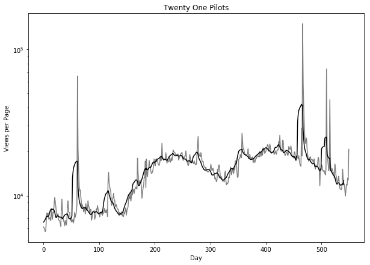

You can see there are some pretty large spikes in the graph, even though we use a logarithmic axis. On some days, views skyrocket to 10X what they were the days before. It becomes clear, that a good model will have to be able to deal with such extreme spikes. It is also clearly visible that there are  global trends, as the page views generally increase over time. For good measure, lets plot the interest in Twenty One Pilots for all languages. 

```Python 
fig, ax = plt.subplots(figsize=(10, 7))
plt.ylabel('Views per Page')
plt.xlabel('Day')
plt.title('Twenty One Pilots Popularity')
ax.set_yscale('log')

for country in ['de','en','es','fr','ru']:
    idx= np.where((train['Subject'] == 'Twenty One Pilots') 
                  & (train['Sub_Page'] == '{}.wikipedia.org'.format(country)) 
                  & (train['Access'] == 'all-access') & 
                  (train['Agent'] == 'all-agents'))
                  
    idx=idx[0][0]
    
    data = train.iloc[idx,0:-4]
    handle = ax.plot(days,data.values,label=country)
    

ax.legend()
```
In this snippet, we first set up the graph, as before. We then loop over the language codes and find the index of the Twenty One Pilots. The index is an array wrapped in a tuple so we have to extract the integer specifying the actual index. We then extract the page view data from the training dataset and plot the page views.

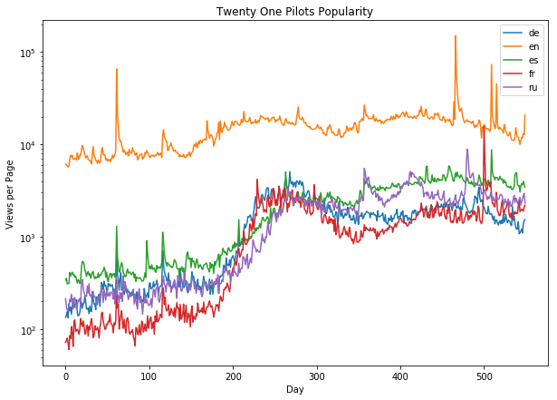

There is clearly some correlation between the time series. The english language wikipedia is, not surprisingly by far the most popular. We can also see that the time series in our datasets are clearly not stationary, they change means and standard deviations. This undermines some of the assumptions many classic modeling approaches make. Yet, financial time series are hardly ever stationary, so it is worthwhile dealing with these problems and there are several good tools that can handle non stationarity.

# Fast Fourier transformations 
Another interesting statistic we often want to compute about time series is the Fourier transformation. Without going into the math, a Fourier transformation shows the amount of oscillation of a particular frequency in a function. You can imagine this like the tuner on an old FM radio. As you turn the tuner, you search through different frequencies. Every once in a while, you find a frequency that gives you a clear signal of a particular radio station. A Fourier transformation basically scans through the entire frequency spectrum and records at which frequencies there is a strong signal. This is useful for finding periodic patterns in time series data. Imagine that we found that the frequency 1/week gives a strong pattern. That would mean that knowledge about what the traffic was the same day last week would help our model. When both the function and the Fourier transform are discrete, which is the case in a series of daily measurements, it is called discrete Fourier transform (DFT). A very fast algorithm for computing DFT is called Fast Fourier Transform, which today has become an important algorithm in scientfific computing. It was know to Gauss in 1805 already, but brought to light by Cooley and Tukey. We will not go into how and why Fourier transformations work exactly mathematically, but only give a brief intuition. Imagine our function as a piece of wire. We take this wire, and wrap it around a point. If you wrap the wire so that the number of revolutions around the point matches the frequency of a signal, all the signal peaks will be on one side of the pole. This means that the center of mass of the wire will move away from the point we wrapped the wire around. In maths, wrapping a function around a point can be done by multiplying the function $g(n)$ with $e^{-2 \pi i f n}$. Where $f$ is the frequency of wrapping, $n$ is the number of the item from the series, $i$ is the imaginary square root of $-1$. Readers that are not familiar with imaginary numbers can think of them as coordinates in which each number has a two dimensional coordinate consisting out of a real and imaginary number. To compute the center of mass, we average the coordinates of the points in our discrete function. The DFT formula is therefore 

$$y[f] = \sum_{n=0}^{N-1} e^{-2 \pi i \frac{f n}{N}} x[n]$$

Where $y[f]$ is the fth element in the transformed series, or the frequency tested, and $x[n]$ is the nth element of the input series $x$. $N$ is the total number of points in the input series. Note that $y[f]$ will be a number with a real and a discrete element. To detect frequencies we are only really interested in the overall magnitude of $y[f]$ so we compute the root of the sum of the squares of the imaginary and real parts. 

In Python, we do not have to worry about all the math. We can use `sklearn`s `fftpack` which has a FFT function built in:

```Python 
data = train.iloc[:,0:-4]
fft_complex = fft(data)
fft_mag = [np.sqrt(np.real(x)*np.real(x)+
                   np.imag(x)*np.imag(x)) for x in fft_complex]
```

Here, we first extract the time series measurements without global features from our training set. We then run the FFT algorithm. Finally, we compute the magnitudes of the transformation. Now we have the Fourier transformations of all time series. We can average them to get a better insight in the general behavior.

```Python 
arr = np.array(fft_mag)
fft_mean = np.mean(arr,axis=0)
```

This first turns the magnitudes into a numpy array to then compute the mean. We want to compute the mean per frequency, not just the mean value of all magnitudes so we need to specify the `axis` along which to take the mean. In this case, the series are stacked in rows, so taking the mean column wise (axis zero) will result in frequency wise means. 

To better plot the transformation, we need to create a list of frequencies tested. The frequencies are day/all days in the dataset for each day, so 1/550, 2/550, 3/550, etc.

```Python 
fft_xvals = [day / fft_mean.shape[0] for day in range(fft_mean.shape[0])]
```

In this visualization we only care about the range of frequencies in a weekly range, so we will remove the second half of the transformation.

```Python 
npts = len(fft_xvals) // 2 + 1
fft_mean = fft_mean[:npts]
fft_xvals = fft_xvals[:npts]
```

And now we finally get to plot our transformation! 

```Python 
fig, ax = plt.subplots(figsize=(10, 7))
ax.plot(fft_xvals[1:],fft_mean[1:])
plt.axvline(x=1./7,color='red',alpha=0.3)
plt.axvline(x=2./7,color='red',alpha=0.3)
plt.axvline(x=3./7,color='red',alpha=0.3)
```

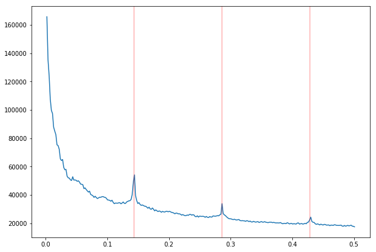

There are spikes at 1/week, speak information from a week ago helps, 2/week, information from half a week ago and 3/week, information from a third of a week ago. The spikes have already been marked with red lines. 

# Autocorrelation

Autocorrelation is the correlation between two elements of a series separated by a given interval. Intuitively, we would for example assume that knowledge about the last time step helps us forecasting the next step. But how about knowledge from two time-steps ago or from 100 steps ago? Autocorrelation plots help answer these questions. An `autocorrelation_plot` plots the correlation between elements with different lag times.

Pandas comes with a handy autocorrelation plotting tool. To use it, we have to pass a series of data. In this case, we pass the page views of a page, selected at random.

```Python 
from pandas.plotting import autocorrelation_plot

autocorrelation_plot(data.iloc[110])
plt.title(' '.join(train.loc[110,['Subject', 'Sub_Page']]))
```

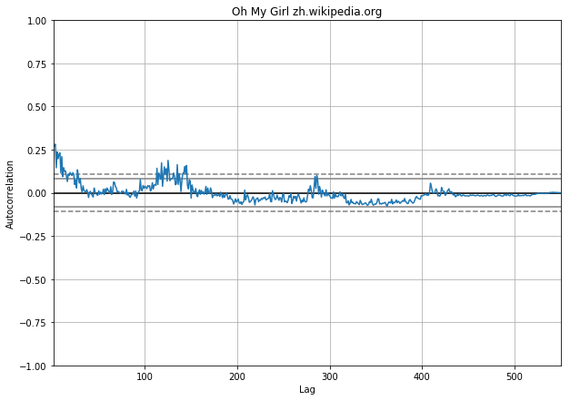

The plot shows the correlation of page views for the wikipedia page of 'Oh My Girl', a South-Korean girl group, in the Chinese wikipedia. You can see that shorter time intervals between 1 and 20 days show a higher autocorrelation than longer intervals. But there are also curious spikes, such as around 120 days and 280 days. Annual, quarterly or monthly events could lead to frequent visits to a wikipedia page. We can examine the general pattern of these frequencies by drawing 1000 of these autocorrelation plots.

```Python 
a = np.random.choice(data.shape[0],1000)

for i in a:
    autocorrelation_plot(data.iloc[i])
    
plt.title('1K Autocorrelations')
```

This code snippet first samples 1000 random numbers between zero and the number of series in our dataset (about 145K). We use these as indices to randomly sample rows from our dataset for which we then draw the autocorrelation plot.


First, we see that autocorrelations can be quite different for different series and that there is a lot of noise. There seems to be a general trend towards higher correlations around 350 days, or roughly annual. It makes sense to incorporate annual lagged page views as a time dependent feature as well as the autocorrelation for one year time intervals as a global feature. The same is true for quarterly and half year lag as these seem to have high autocorrelations or sometimes quite negative autocorrelations which makes them valuable as well. 

Time series analysis like the examples shown above help engineer features for our model. Complex neural networks could in theory discover all features by themselves, however, it is often much easier to help them a bit, especially with information about long time periods. 

# Establishing a training & testing regime
Even with lots of data available, we have to ask ourselves how we want to split data into training, validation and testing data. The dataset already comes with a test set of future data, so we do not have to worry about the test set. For the validation set, there are two ways of splitting: 


In a walk forward split, we train on all 145 thousand series. To validate, we use more recent data from all series. In side by side splitting we sample a number of series for training and use the rest for validation. Both have advantages and disadvantages. The disadvantage of walk forward splitting is that we can not use all observations of the series for our predictions. The disadvantage of side by side splitting is that we can not use all series for training. If we have few series, but many data observations per series, a walk forward split is preferable. It also aligns more nicely with the forecasting problem, at hand. In side by side splitting, the model might overfit to global events in the prediction period. Imagine that wikipedia was down for a week in the prediction period used in side by side splitting. This would reduce views for all pages, and the model would overfit to this global event. We would not catch the overfitting in our validation set as the prediction period in our validation set is also affected by the global event. However, in our case we have many time series, but only about 550 observations per series. There seem to be no global events that would have significantly impacted all wikipedia pages in a time period. However, there are some global events that impacted views for some pages, such as the olympic winter games. Yet, this is a reasonable risk in this case, as the number of pages affected by such global events are still small. Since we have an abundance of series and only few observations per series, a side by side split is more feasible in our case.

In this chapter we focus on forecasting traffic for 50 days. So we first split the last 50 days of each series form the rest before splitting training and validation set.

```Python
from sklearn.model_selection import train_test_split

X = data.iloc[:,:500]
y = data.iloc[:,500:]

X_train, X_val, y_train, y_val = train_test_split(X.values, y.values, 
                                                  test_size=0.1, 
                                                  random_state=42)
``` 
When splitting, we use `X.values` to only get the data, not a DataFrame containing the data. This operations leaves us with 130,556 series to train and 14,507 for validation. We use mean absolute percentage (MAPE) error as a loss and evaluation metric. MAPE can cause division by zero errors if the true value of y is zero. We thus use a small value epsilon to prevent division by zero.

```Python 
def mape(y_true,y_pred):
    eps = 1
    err = np.mean(np.abs((y_true - y_pred) / (y_true + eps))) * 100
    return err
```

# A note on backtesting
The peculiarities of choosing training and testing sets are especially important in systematic investing and algorithmic trading. The main way to test trading algorithms is a process called **backtesting**. Backtesting means we train the algorithm on data from a certain time period and then test its performance on _older_ data. For example we could train on data from 2015 to 2018 and then test on data from 1990 to 2015. Usually not only the models accuracy is tested, but the backtested algorithm executes virtual trades so its profitability can be evaluated. Backtesting is done because there is plenty of past data available. 

Backtesting suffers from several biases such as
- Look-Ahead bias: Introduced if future data is accidentally included at a point in the simulation where that data would not have been available yet. This can be caused by a technical bug in the simulator. But it can also stem from parameter calculation. If a strategy makes use of the correlation between two securities for example and the correlation is calculated for all time once, a look-ahead bias is introduced. The same goes for the calculation of maxima or minima.
- Survivorship bias: Introduced if only stocks that still exist at the time of testing are included in the simulation. Consider for example the 2008 financial crisis in which many firms went bankrupt. Leaving the stocks of these firms out when building a simulator in 2018 would introduce survivorship bias. After all, the algorithm could have invested in those stocks in 2008. 
- Psychological tolerance bias: What looks good in a backtest might not be good in real life. Consider an algorithm that looses money for 4 months in a row before making it all back in a backtest. We might feel satisfied with this algorithm. However, if the algorithm looses money for 4 months in a row in real life and we do not know if it makes it back, will we sit tight or pull the plug? In the backtest we know the final result, but in real life we do not.
- Overfitting: A problem for all machine learning algorithms but in backtesting, overfitting is a persistent and insidious problem. Because not only does the algorithm potentially overfit, the designer of the algorithm might use knowledge about the past to and build an algorithm that overfits to it. It is easy to pick stocks in hindsight and the knowledge can be incorporated in models which then look great in backtests. It might be subtle, such as relying on certain correlations that held up well in the past but it is easily to unconsciously build bias into models that are evaluated in backtesting.

Building good testing regimes is a core activity of any quantitative investment firm or anyone working intensively with forecasting. Two popular strategies to test algorithms other than backtesting are testing models on data that is statistically similar to stock data but generated. We might build a generator for data that looks like real stock data but is not real, thus avoiding knowledge about real market events creeping into our models. Another option is to deploy models silently and test them in the future. The algorithm runs but executes only virtual trades so that if things go wrong, no money is lost. This approach makes use of future data instead of past data. The downside is that we have to wait for quite a while until the algorithm can be used.

In practice, a combination regimes is used. Statisticians carefully design regimes to see how an algorithm responds to different simulations. In our web traffic forecasting model we will simply validate on different pages and then test on future data in the end.

# Median forecasting
A good sanity check and sometimes underrated forecasting tool are medians. A median is the value separating the higher half of a distribution from the lower half, they sit exactly in the middle of the distribution. Medians have the advantage of removing noise. They are less susceptible to outliers than means and capture the mid point of a distribution. They are also easy to compute. 

To make a forecast, we compute the median over a look-back window in our training data. In this case, we use a window size of 50, but you could experiment with other values. We then select the last 50 values from our X values and compute the median. Note that in the numpy median function, we have to set `keepdims=True`. This ensures that we keep a two dimensional matrix rather than a flat array which is important when computing the error. 

```Python 
lookback = 50

lb_data = X_train[:,-lookback:]

med = np.median(lb_data,axis=1,keepdims=True)

err = mape(y_train,med)
``` 

We obtain an error of about 68.1%, not bad given the simplicity of our method. To see how the medians work, lets plot the X values, true y values and predictions for a random page.

```Python 
idx = 15000

fig, ax = plt.subplots(figsize=(10, 7))


ax.plot(np.arange(500),X_train[idx], label='X')
ax.plot(np.arange(500,550),y_train[idx],label='True')

ax.plot(np.arange(500,550),np.repeat(med[idx],50),label='Forecast')

plt.title(' '.join(train.loc[idx,['Subject', 'Sub_Page']]))
ax.legend()
ax.set_yscale('log')
```  

As you can see, our plotting consists of drawing three plots. For each plot we specify the X and Y values for the plot. For `X_train`, the X values range from zero to 500, for `y_train` and the forecast they range from 500 to 550. From our training data, we select the series we want to plot by indexing. Since we have only one median value, we repeat the median forecast of the desired series 50 times to draw our forecast. 


As you can see, the data for this page, the image of American actor Eric Stoltz is very noisy, and the median cuts through all the noise. This is especially useful for pages that are visited infrequently and for which there is no clear trend or pattern. 

A lot of further work could be done with medians. You could for example use different medians for weekends or use a median of medians from multiple look-back periods. A simple tool like median forecasting can deliver good results with smart feature engineering. It makes sense to use a bit of time on implementing it as a baseline and sanity check before using more advanced methods.

# ARIMA
Earlier, in the section on exploratory data analysis, we already talked about how seasonality and stationarity are important to forecasting time series. In fact, median forecasting has trouble with both. If the mean of a time series continuously shifts, median forecasting will not continue the trend. And if a time series shows cyclical behavior, the median will not continue with the cycle. ARIMA stands for Autoregressive Integrated Moving Average:
- **Autoregression**: The model uses the relationship between a value and a number of lagged observations.
- **Integrated**: The model uses the difference between raw observations to make the time series stationary. A time series going continuously upward will have a flat integral as the differences between points are always the same.
- **Moving Average**: The model uses residual errors from a moving average.

We have to manually specify how many lagged observations we want to include $p$, how often we want to differentiate the series $d$, and how large the moving average window should be $q$. ARIMA then performs linear regression against all included lagged observations and moving average residuals on the differentiated series.

We can use ARIMA in Python with `statsmodels`, a library with many helpful statistical tools. 

```Python 
from statsmodels.tsa.arima_model import ARIMA
```

To create a new ARIMA model, we pass the data we want to fit, views for 2NE1 in the Chinese wikipedia, as well as the desired values for $p$, $d$ and $q$ in that order. In this case we want to include 5 lagged observations, differentiate 1 time and take a moving average window of 5.

```Python 
model = ARIMA(X_train[0], order=(5,1,5))
```

We fit of the model using `model.fit()`
```Python 
model = model.fit()
```

`model.summary()` will output all coefficients as well as significance values for statistical analysis. We are more interested in how good our model does in forecasting. 

```Python
residuals = pd.DataFrame(model.resid)
ax.plot(residuals)

plt.title('ARIMA residuals for 2NE1 pageviews')
```

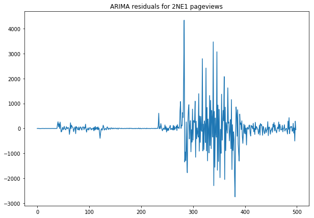

We can see that the model does very well in the beginning but struggles around the 350 day mark. This can be because page views are harder to predict or there is more volatility in this period. To ensure that our model is not skewed, we need to examine the distribution of the residuals. We can do this by plotting a kernel density estimator, a mathematical method to estimate distributions without needing to model them.

```Python 
residuals.plot(kind='kde',
               figsize=(10,7),
               title='ARIMA residual distribution 2NE1 ARIMA',
               legend = False)
```

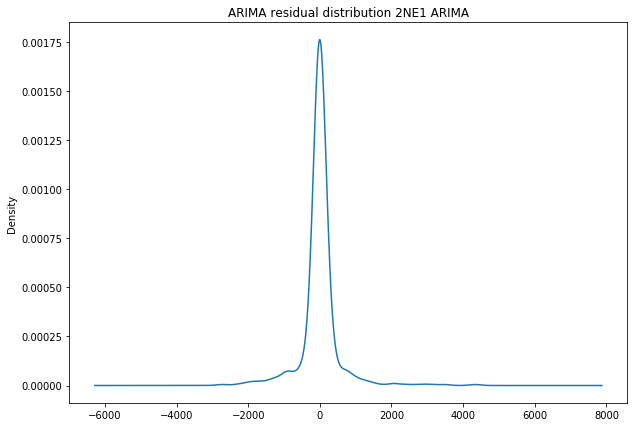

As you can see our model roughly represents a gaussian distribution with a mean of zero. All good on that front, so how do we make forecasts?

To use this model for forecasting, all we have to do is to specify the number of days we want to forecast.

```Python
predictions, stderr, conf_int = model.forecast(50)
``` 

This forecast not only gives us predictions, but also the standard error and confidence interval (95% by default). 

Lets plot the projected views against the real views to see how we are doing. This graph shows the last 20 days fo our prediction basis as well as the forecast to keep things readable.

```Python 
fig, ax = plt.subplots(figsize=(10, 7))


ax.plot(np.arange(480,500),basis[480:], label='X')
ax.plot(np.arange(500,550),y_train[0], label='True')
ax.plot(np.arange(500,550),predictions, label='Forecast')

plt.title('2NE1 ARIMA forecasts')
ax.legend()
ax.set_yscale('log')
``` 

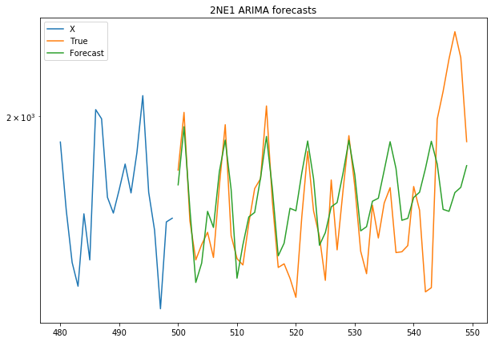

You can see that ARIMA captures the periodicity of the series very well. Its forecasts steer a bit of towards the end, but in the beginning it does a remarkable job. 

# Kalman filters
Kalman filters are a method to extract a signal from noisy or incomplete measurements. They were invented by Rudolf Emil Kalman for electrical engineering purposes and were first used in the Apollo program in the 1960s. 

The basic idea behind Kalman filters is that there is some hidden state of a system which we can not observe directly but for which we can obtain noisy measurements. Imagine you want to measure the temperature inside a rocket engine. You can not put a measurement device directly into the engine, its too hot, but you can have a device on the outside of the engine. Naturally, this measurement is not perfect, as there is lots of stuff going on the outside of the engine that makes the measurement noisy. To estimate the temperature inside the rocket, you therefore need a method that can deal with noise. We can imagine the internal state in the page forecasting as the actual interest in a certain page of which the page views represent only a noisy measurement.

The idea is that the internal state $x_k$ at time $k$ is a state transition matrix $A$ multiplied with the previous internal state $x_{k-1}$ plus some process noise $q_{k−1}$. How interest in 2NE1 develops is to some degree random. The randomness is assumed follow a gaussian normal distribution with mean zero and variance $Q$

$$x_k = Ax_{k-1} + q_{k-1}, \qquad q_{k−1}∼N(0,Q)$$

The obtained measurement at time $k$, $y_k$ is an observation model $H$, describing how states translate to measurements times the state $x_k$ plus some observation noise $r_k$. The observation noise is assumed to follow a gaussian normal distribution with mean zero and variance $R$.

$$y_k = Hx_k + r_k, \qquad r_k∼N(0,R)$$

Roughly speaking, Kalman filters fit a function by estimating $A$, $H$, $Q$ and $R$. The process of going over a time series and updating the parameters is called smoothing. The exact mathematics of the estimation process are complicated and not very relevant if all we want to do is forecasting. Yet, what is relevant is that we need to provide priors to these values. 

Note that our state does not have to be only one number. In this case, our state is an 8 dimensional vector, one hidden level as well as seven levels to capture weekly seasonality.

```Python
n_seasons = 7

state_transition = np.zeros((n_seasons+1, n_seasons+1))

state_transition[0,0] = 1

state_transition[1,1:-1] = [-1.0] * (n_seasons-1)
state_transition[2:,1:-1] = np.eye(n_seasons-1)
```

The transition matrix $A$ looks like this, describing one hidden level, which we might interpret as the real interest as well as a seasonality model.

``` 
array([[ 1.,  0.,  0.,  0.,  0.,  0.,  0.,  0.],
       [ 0., -1., -1., -1., -1., -1., -1.,  0.],
       [ 0.,  1.,  0.,  0.,  0.,  0.,  0.,  0.],
       [ 0.,  0.,  1.,  0.,  0.,  0.,  0.,  0.],
       [ 0.,  0.,  0.,  1.,  0.,  0.,  0.,  0.],
       [ 0.,  0.,  0.,  0.,  1.,  0.,  0.,  0.],
       [ 0.,  0.,  0.,  0.,  0.,  1.,  0.,  0.],
       [ 0.,  0.,  0.,  0.,  0.,  0.,  1.,  0.]])
``` 
The observation model $H$ maps the general interest plus seasonality to a single measurement.

```Python
observation_model = [[1,1] + [0]*(n_seasons-1)]
``` 

The observation model looks like this:
```
[[1, 1, 0, 0, 0, 0, 0, 0]]
``` 

The noise priors are just estimates scaled by a 'smoothing factor', which allows us to control the update process. 
```Python 
smoothing_factor = 5.0

level_noise = 0.2 / smoothing_factor
observation_noise = 0.2
season_noise = 1e-3

process_noise_cov = np.diag([level_noise, season_noise] + [0]*(n_seasons-1))**2
observation_noise_cov = observation_noise**2
``` 

`process_noise_cov` is an 8 dimensional vector, matching the 8 dimensional state vector, `observation_noise_cov` is a single number, as we have only a single measurement. The only real requirement for these priors is that their shapes must allow the matrix multiplications described in the two formulas above. Other than that, we are free to specify transition models as we see them. 

Otto Seiskari, a mathematician and 8th place winner in the original wikipedia traffic forecasting competition wrote a very fast Kalman filtering library, which we will use here. It allows for vectorized processing of multiple independent time series, which is very handy if you have 145 thousand time series to process. You can install his library using 

```
pip install simdkalman
``` 
And import it with
```Python 
import simdkalman
``` 

Although `simdkalman` is very sophisticated, it is quite simple to use. First, we specify a Kalman filter using the priors we just defined:

```Python 
kf = simdkalman.KalmanFilter(state_transition = state_transition,
                             process_noise = process_noise_cov,
                             observation_model = observation_model,
                             observation_noise = observation_noise_cov)
``` 

We can then estimate the parameters and compute a forecast in one step.

```Python 
result = kf.compute(X_train[0], 50)
```

Once again we make forecasts for 2NE1s Chinese page, and create a forecast for 50 days. Note that we could also pass multiple series (e.g. the first 10 with `X_train[:10]`) and compute separate filters for all of them at once. 

The result of the compute function contains the state and observation estimates from the smoothing process as well as predicted internal states and observations. States and observations are gaussian distributions, so to get a plottable value we need to access their mean. Our states are 8 dimensional but we only care about the non seasonal state value, so we need to index the mean.

```Python 
fig, ax = plt.subplots(figsize=(10, 7))
ax.plot(np.arange(480,500),X_train[0,480:], label='X')
ax.plot(np.arange(500,550),y_train[0],label='True')

ax.plot(np.arange(500,550),
        result.predicted.observations.mean,
        label='Predicted observations')


ax.plot(np.arange(500,550),
        result.predicted.states.mean[:,0],
        label='predicted states')

ax.plot(np.arange(480,500),
        result.smoothed.observations.mean[480:],
        label='Expected Observations')

ax.plot(np.arange(480,500),
        result.smoothed.states.mean[480:,0],
        label='States')


ax.legend()
ax.set_yscale('log')
```
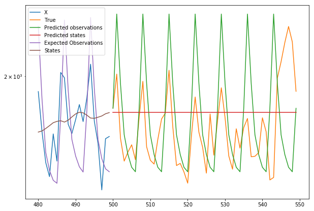

We can clearly see the effects of our prior modeling on the predictions. We can see the model predicts strong weekly oscillation, stronger than actually observed. We can also see that the model does not anticipate any trends, since we did not model trends in our prior. 

Kalman filters are a useful tool and are used in many applications from electrical engineering to finance. Until relatively recently, they were the go to tool fore time series modeling in many cases. Smart modelers were able to create smart systems that described time series very well. However, Kalman filters can not discover patterns by themselves and need carefully engineered priors. In the second half of this chapter, we will look at neural network based approaches that can model time series more automatically, and often more accurately.

# Forecasting with neural nets
The second half of the chapter is all about neural networks. In the first part, we will build a simple neural network that only forecasts the next time step. Since the spikes in the series are very large, we will work with log transformed pageviews in input and output. We can use the short term forecast neural net to make longer term forecasts, too, by feeding its predictions back into the network.
But before we can dive in, wee need to do some preprocessing & feature engineering. The advantage of neural networks is that they can take in many features and very high dimensional data. The disadvantage is that we have to be careful about which features we input. Remember of Look-Ahead bias, including data that would not have been available at forecasting time, is a problem in backtesting. We might also include future data into the features.

## Data preparation
For each series, we will assemble the following features:

- `log_view`: The natural logarithm of page views. Since the logarithm of zero is undefined, we will use `log1p`, which is the natural logarithm of pageviews plus one.
- `days`: One hot encoded weekdays 
- `year_lag`: The value of `log_view` from 365 days ago. -1 if there is no value available. 
- `halfyear_lag`: The value of `log_view` from 182 days ago. -1 if there is no value available. 
- `quarter_lag`: The value of `log_view` from 91 days ago. -1 if there is no value available. 
- `page_enc` One hot encoded sub page.
- `agent_enc` One hot encoded agent.
- `acc_enc` One hot encoded access method. 
- `year_autocorr` Autocorrelation of the series of 365 days. 
- `halfyr_autocorr` Autocorrelation of the series of 182 days.
- quarter_autocorr, Autocorrelation of the series of 91 days.
- `medians` the median of pageviews over the lookback period.

These features are assembled for each time series, giving our input data the shape (batch size, look back window size, 29). 

### Week days 
```Python
import datetime
from sklearn.preprocessing import LabelEncoder
from sklearn.preprocessing import OneHotEncoder

weekdays = [datetime.datetime.strptime(date, '%Y-%m-%d').strftime('%a') 
            for date in train.columns.values[:-4]]
``` 
First, we turn the date strings (like '2017-03-02') into their weekday ('Thursday').

```Python
day_one_hot = LabelEncoder().fit_transform(weekdays)
day_one_hot = day_one_hot.reshape(-1, 1)
```
We then encode the weekdays into integers, so that 'Monday' becomes 1, 'Tuesday' becomes 2 and so on. We reshape the resulting array into a rank 2 tensor with shape (array length, 1) so that the one hot encoder knows that we have many observations, but only one feature, not the other way around.

```Python
day_one_hot = OneHotEncoder(sparse=False).fit_transform(day_one_hot)
day_one_hot = np.expand_dims(day_one_hot,0)
``` 
Finally, we one hot encode the days. We then add a new dimension to the tensor showing that we have only one 'row' of dates. We will later repeat the array along this axis.

```Python 
agent_int = LabelEncoder().fit(train['Agent'])
agent_enc = agent_int.transform(train['Agent'])
agent_enc = agent_enc.reshape(-1, 1)
agent_one_hot = OneHotEncoder(sparse=False).fit(agent_enc)

del agent_enc
``` 
We will need the encoders for the agents later when we encode the agent of each series. Here, we first create a `LabelEncoder` that can transform the agent name strings into integers. We then transform all agents into such an integer string to setup a `OneHotEncoder` that can one hot encode the agents. To save memory, we will then delete the already encoded agents. 

We do the same for sub pages and access methods. 

```Python 
page_int = LabelEncoder().fit(train['Sub_Page'])
page_enc = page_int.transform(train['Sub_Page'])
page_enc = page_enc.reshape(-1, 1)
page_one_hot = OneHotEncoder(sparse=False).fit(page_enc)

del page_enc

acc_int = LabelEncoder().fit(train['Access'])
acc_enc = acc_int.transform(train['Access'])
acc_enc = acc_enc.reshape(-1, 1)
acc_one_hot = OneHotEncoder(sparse=False).fit(acc_enc)

del acc_enc
```

Now we come to the lagged features. Technically, neural networks could discover which past events are relevant for forecasting themselves. However, this is pretty difficult because of the vanishing gradient problem, covered in more detail in the LSTM section of this chapter. For now, let's just set up a little function that creates an array lagged by a number of days.

```Python 
def lag_arr(arr, lag, fill):
    filler = np.full((arr.shape[0],lag,1),-1)
    comb = np.concatenate((filler,arr),axis=1)
    result = comb[:,:arr.shape[1]]
    return result
```
This function first creates a new array that will fill up the 'empty space' from the shift. The new array has as many rows as the original array but its series length, or width, is the number of days we want to lag. We then attach this array to the front of our original array. Finally, we remove elements from the back of the array to get back to the original array series length, or width. 

We want to inform our model about the amount of autocorrelation for different time intervals. To compute the autocorrelation for a single series, we shift the series by the amount of lag we want to measure the autocorrelation for. We then compute the autocorrelation. 

$$R(\tau) = \frac{\sum ((X_t - \mu_t) * 
  
  (X_{t + \tau} - \mu_{t + \tau}))}
  
{\sigma_t * \sigma_{t + \tau}} $$

Where $\tau$ is the lag indicator.
We do not just use a numpy function since there is a real possibility that the divider is zero. In this case, our function will just return zero.
```Python 
def single_autocorr(series, lag):
    s1 = series[lag:]
    s2 = series[:-lag]
    ms1 = np.mean(s1)
    ms2 = np.mean(s2)
    ds1 = s1 - ms1
    ds2 = s2 - ms2
    divider = np.sqrt(np.sum(ds1 * ds1)) * np.sqrt(np.sum(ds2 * ds2))
    return np.sum(ds1 * ds2) / divider if divider != 0 else 0
```
We can use this function we wrote for a single series to create a batch of autocorrelation features.

```Python 
def batc_autocorr(data,lag,series_length):
    corrs = []
    for i in range(data.shape[0]):
        c = single_autocorr(data, lag)
        corrs.append(c)
    corr = np.array(corrs)
    corr = np.expand_dims(corr,-1)
    corr = np.expand_dims(corr,-1)
    corr = np.repeat(corr,series_length,axis=1)
    return corr
```
First, we calculate autocorrelations for each series in the batch. Then we fuse the correlations together into one numpy array. Since autocorrelations are a global feature, we create a new dimension for the length of the series and another new dimension to show that this is only one feature. We then repeat the autocorrelations over the entire length of the series. 

The `get_batch` function produces utilizes all these tools to provide one batch of data.
```Python
def get_batch(train,start=0,lookback = 100):
    # 1
    assert((start + lookback) <= (train.shape[1] - 5))
    
    # 2
    data = train.iloc[:,start:start + lookback].values
    
    # 3
    target = train.iloc[:,start + lookback].values
    target = np.log1p(target)
    
    # 4
    log_view = np.log1p(data)
    log_view = np.expand_dims(log_view,axis=-1)
    
    # 5
    days = day_one_hot[:,start:start + lookback]
    days = np.repeat(days,repeats=train.shape[0],axis=0)
    
    # 6
    year_lag = lag_arr(log_view,365,-1)
    halfyear_lag = lag_arr(log_view,182,-1)
    quarter_lag = lag_arr(log_view,91,-1)
    
    # 7
    agent_enc = agent_int.transform(train['Agent'])
    agent_enc = agent_enc.reshape(-1, 1)
    agent_enc = agent_one_hot.transform(agent_enc)
    agent_enc = np.expand_dims(agent_enc,1)
    agent_enc = np.repeat(agent_enc,lookback,axis=1)
    
    # 8
    page_enc = page_int.transform(train['Sub_Page'])
    page_enc = page_enc.reshape(-1, 1)
    page_enc = page_one_hot.transform(page_enc)
    page_enc = np.expand_dims(page_enc, 1)
    page_enc = np.repeat(page_enc,lookback,axis=1)
    
    # 9
    acc_enc = acc_int.transform(train['Access'])
    acc_enc = acc_enc.reshape(-1, 1)
    acc_enc = acc_one_hot.transform(acc_enc)
    acc_enc = np.expand_dims(acc_enc,1)
    acc_enc = np.repeat(acc_enc,lookback,axis=1)
    
    # 10
    year_autocorr = batc_autocorr(data,lag=365,series_length=lookback)
    halfyr_autocorr = batc_autocorr(data,lag=182,series_length=lookback)
    quarter_autocorr = batc_autocorr(data,lag=91,series_length=lookback)
    
    # 11
    medians = np.median(data,axis=1)
    medians = np.expand_dims(medians,-1)
    medians = np.expand_dims(medians,-1)
    medians = np.repeat(medians,lookback,axis=1)
    
    # 12
    batch = np.concatenate((log_view,
                            days, 
                            year_lag, 
                            halfyear_lag, 
                            quarter_lag,
                            page_enc,
                            agent_enc,
                            acc_enc, 
                            year_autocorr, 
                            halfyr_autocorr,
                            quarter_autocorr, 
                            medians),axis=2)
    
    return batch, target
``` 
Let's walk through this step by step.

\# 1 Ensures there is enough data to create a lookback window and a target from the given starting point.

\# 2 Separates the lookback window out of the training data.

\# 3 Separates the target and then takes the one plus logarithm of it.

\# 4 Takes the one plus logarithm of the lookback window and adds a feature dimension.

\# 5 Gets the days from the precomputed one hot encoding of days and repeats it for each time series in the batch.

\# 6 Computes the lag features for year lag, half year lag and quarterly lag.

\# 7, 8 & 9 encode the global features using the encoders defined above.

\# 10 Calculates the year, half year and quarterly autocorrelation.

\# 11 Calculates the median for the lookback data.

\# 12 fuses all these features into one batch.

Finally, we can use our `get_batch` function to write a generator, just like we did in chapter 3. It loops over the original training set and passes a subset into the `get_batch` function. It then yields the batch obtained. Note that we choose random starting points to make the most out of our data.
```Python 
def generate_batches(train,batch_size = 32, lookback = 100):
    num_samples = train.shape[0]
    num_steps = train.shape[1] - 5
    while True:
        for i in range(num_samples // batch_size):
            batch_start = i * batch_size
            batch_end = batch_start + batch_size

            seq_start = np.random.randint(num_steps - lookback)
            X,y = get_batch(train.iloc[batch_start:batch_end],start=seq_start)
            yield X,y
``` 
We will train and validate with this function.

# Conv1D
You might remember convolutional neural networks from computer vision week. In computer vision, convolutional filters slide over the image two dimensionally. There is also a version of convolutional filters that can slide over a sequence one dimensionally. The output is another sequence, much like the output of a two dimensional convolution was another 'image'. Everything else about 1D convolutions is exactly the same as 2D convolutions.

We will first build a ConvNet that expects a fixed input length.
```Python
n_features = 29
max_len = 100
``` 

```Python 

model = Sequential()

model.add(Conv1D(16,5, input_shape=(100,29)))
model.add(Activation('relu'))
model.add(MaxPool1D(5))

model.add(Conv1D(16,5))
model.add(Activation('relu'))
model.add(MaxPool1D(5))
model.add(Flatten())
model.add(Dense(1))
``` 

You will notice that next to `Conv1D` and `Activation` there are two more layers in this network:
- `MaxPool1D` works exactly like MaxPooling2D which we used earlier. It takes a piece of the sequence with specified length and returns the maximum element in the sequence much like it returned the maximum element of a small window in 2D convolutional networks. Note that MaxPooling always returns the maximum element for each channel.
- `Flatten` transforms the 2D sequence tensor into a 1D flat tensor. To use `Flatten` in combination with `Dense`, we need to specify the sequence length in the input shape. Here, we set it with the `max_len` variable. This is because `Dense` expects a fixed input shape and flatten will return a tensor based on the size of its input. An alternative to using `Flatten` is `GlobalMaxPool1D` which returns the maximum element of the entire sequence. Since this is fixed in size, you can use a `Dense` layer afterwards without fixing the input length.

Our model compiles just as you know it.
```Python 
model.compile(optimizer='adam',loss='mean_absolute_percentage_error')
``` 

We train it on the generator we wrote earlier. To obtain separate train and validation sets, we first split the overall dataset and then create two generators based on the two datasets.
```Python 
from sklearn.model_selection import train_test_split

batch_size = 128
train_df, val_df = train_test_split(train, test_size=0.1)
train_gen = generate_batches(train_df,batch_size=batch_size)
val_gen = generate_batches(val_df, batch_size=batch_size)

n_train_samples = train_df.shape[0]
n_val_samples = val_df.shape[0]
```

Finally, we can train our model on a generator just like we did in computer vision.

```Python 
model.fit_generator(train_gen, 
                    epochs=20,
                    steps_per_epoch=n_train_samples // batch_size, 
                    validation_data= val_gen, 
                    validation_steps=n_val_samples // batch_size)
```
# Dilated and causal convolution 

As discussed in the section of backtesting, we have to make sure that our model does not suffer from Look-Ahead bias. 
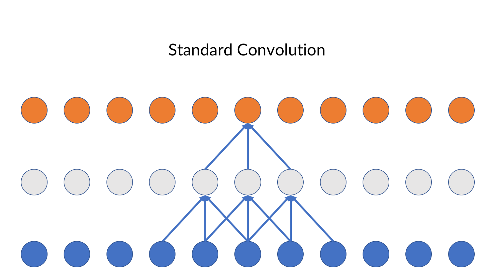 
As the convolutional filter slides over the data, it looks into the future as well as the past. Causal convolution ensures, that the output at time t derives only from inputs from time t - 1.

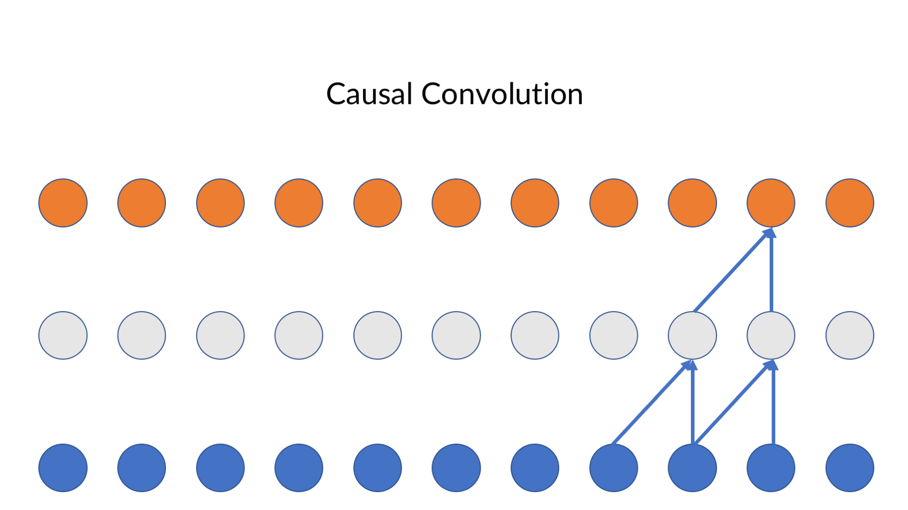

In Keras, all we have to do is to set the `padding` parameter to `'causal'`
```Python 
model.add(Conv1D(16,5, padding='causal'))
```
Another useful trick are dilated convolutional networks. Dilation means that the filter accesses only every nth element.

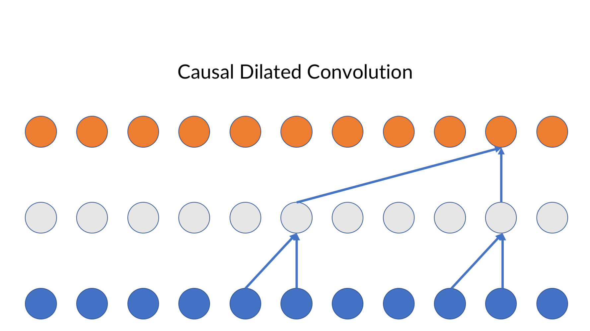

In the image above, the upper convolutional layer has a dilation rate of 4 and the lower layer a dilation rate of 1. We can set the dilation rate in Keras:

```Python 
model.add(Conv1D(16,5, padding='causal', dilation_rate=4))
```

# SimpleRNN
Another method to make order matter in neural networks is to give the network some kind of memory. So far, all of our networks did a forward pass without any memory of what happened before or after the pass. It is time to change that with recurrent neural networks.


Recurrent neural networks contain recurrent layers. Recurrent layers can remember their last activation and use it as their own input.

$$A_{t} = activation( W * in + U * A_{t-1} + b)$$

A recurrent layer takes a sequence as an input. For each element, it then computes a matrix multiplication ($W * in$) just like a ``Dense`` layer and runs the result through an activation function like e.g. ``relu``. It then retains it's own activation. When the next item of the sequence arrives, it performs the matrix multiplication as before but it also multiplies it's previous activation with a second matrix ($U * A_{t-1}$). It adds the result of both operations together and passes it through it's activation function again. In Keras, we can use a simple RNN like this:

```Python 
from keras.layers import SimpleRNN

model = Sequential()
model.add(SimpleRNN(16,input_shape=(max_len,n_features)))
model.add(Dense(1))

model.compile(optimizer='adam',loss='mean_absolute_percentage_error')
```
The only parameter we need to specify is the size of the recurrent layer. This is basically the same as setting the size of a `Dense` layer, as `SimpleRNN` layers are very similar to `Dense` layers except that they feed their output back in as input.
RNNs by default only return the last output of the sequence. To stack multiple RNNs we need to set `return_sequences` to `True`:
```Python
from keras.layers import SimpleRNN

model = Sequential()
model.add(SimpleRNN(16,return_sequences=True,input_shape=(max_len,n_features)))
model.add(SimpleRNN(32, return_sequences = True))
model.add(SimpleRNN(64))
model.add(Dense(1))

model.compile(optimizer='adam',loss='mean_absolute_percentage_error')
```

# LSTM 

In the last section we already learned about basic recurrent neural networks. In theory, simple RNN's should be able to retain even long term memories. However, in practice, this approach often falls short. This is because of the 'vanishing gradients' problem. Over many timesteps, the network has a hard time keeping up meaningful gradients. See e.g. Learning long-term dependencies with gradient descent is difficult (Bengio, Simard and Frasconi, 1994) for details.

In direct response to the vanishing gradients problem of simple RNN's, the Long Short Term Memory layer was invented. Before we dive into details, let's look at a simple RNN 'unrolled' over time:

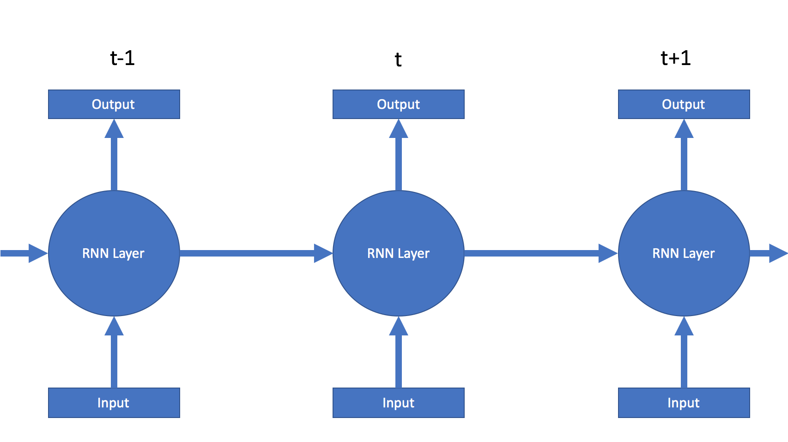

You can see that this is the same as the RNN we saw in the previous chapter, just unrolled over time.

## The Carry 
The central addition of an LSTM over an RNN is the carry. The carry is like a conveyor belt which runs along the RNN layer. At each time step, the carry is fed into the RNN layer. The new carry gets computed in a separate operation from the RNN layer itself from the input, RNN output and old carry.


The ``Compute Carry`` can be understood as three parts:

Determine what should be added from input and state:

$$i_t = a(s_t \cdot Ui + in_t \cdot Wi + bi)$$

$$k_t = a(s_t \cdot Uk + in_t \cdot Wk + bk)$$

where $s_t$ is the state at time $t$ (output of the simple rnn layer), $in_t$ is the input at time $t$ and $Ui$, $Wi$ $Uk$, $Wk$ are model parameters (matrices) which will be learned. $a()$ is an activation function.

Determine what should be forgotten from state an input:

$$f_t = a(s_t \cdot Uf) + in_t \cdot Wf + bf)$$

The new carry is the computed as 

$$c_{t+1} = c_t * f_t + i_t * k_t$$

While the standard theory claims that the LSTM layer learns what to add and what to forget, in practice nobody knows what really happens inside an LSTM. However, they have been shown to be quite effective at learning long term memory.

Note that ``LSTM``layers do not need an extra activation function as they already come with a tanh activation function out of the box.

LSTMs can be used the same way as `SimpleRNN`:

```Python 
from keras.layers import LSTM

model = Sequential()
model.add(LSTM(16,input_shape=(max_len,n_features)))
model.add(Dense(1))
```

To stack layers, you also need to set `return_sequences` to `True`. Note that you can easily combine `LSTM` and `SimpleRNN`.
```Python
model = Sequential()
model.add(LSTM(32,return_sequences=True,input_shape=(max_len,n_features)))
model.add(SimpleRNN(16, return_sequences = True))
model.add(LSTM(16))
model.add(Dense(1))
``` 

Tipp: If you are using a GPU and tensorflow backend with Keras, use a `CuDNNLSTM` instead of `LSTM`. It is significantly faster while otherwise working exactly the same.

# Recurrent dropout 
You have already heard of dropout. Dropout removes some elements of one layers input at random. A common and important tool in recurrent neural networks is recurrent dropout. Recurrent dropout does not remove any inputs between layers but inputs between time steps.

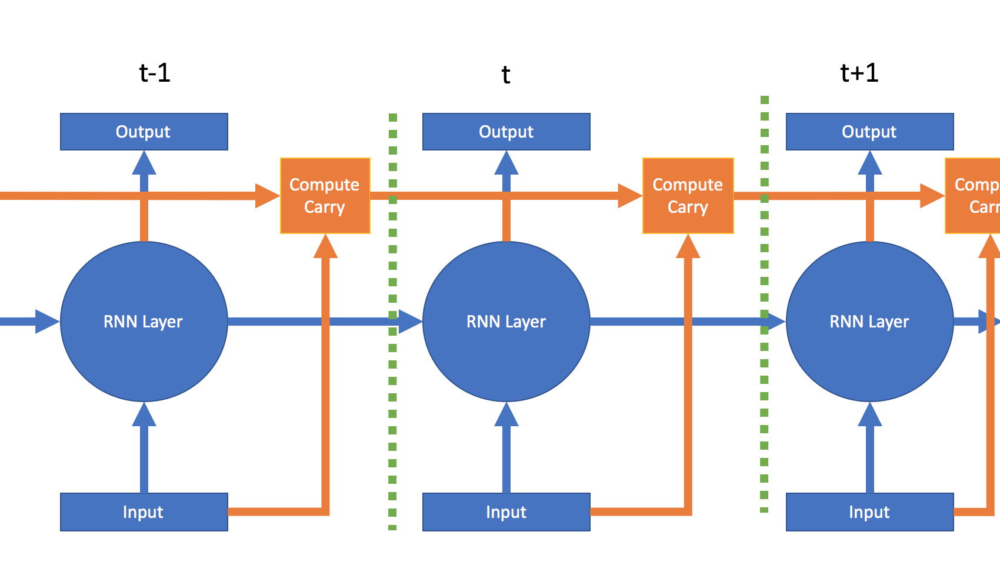

Just as regular dropout, recurrent dropout has a regularizing effect and can prevent overfitting. It is used in Keras by simply passing an argument to the LSTM or RNN layer. Recurrent Dropout, unlike regular dropout, does not have an own layer.

```Python 
model = Sequential()
model.add(LSTM(16, 
               recurrent_dropout=0.1,
               return_sequences=True,
               input_shape=(max_len,n_features)))

model.add(LSTM(16,recurrent_dropout=0.1))

model.add(Dense(1))
```

# Uncertainty in neural nets - Bayesian deep learning
http://mlg.eng.cam.ac.uk/yarin/blog_3d801aa532c1ce.html

https://github.com/kyle-dorman/bayesian-neural-network-blogpost/blob/master/README.md